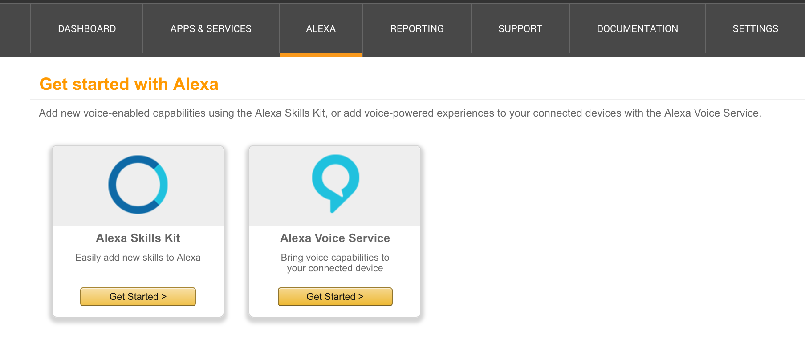
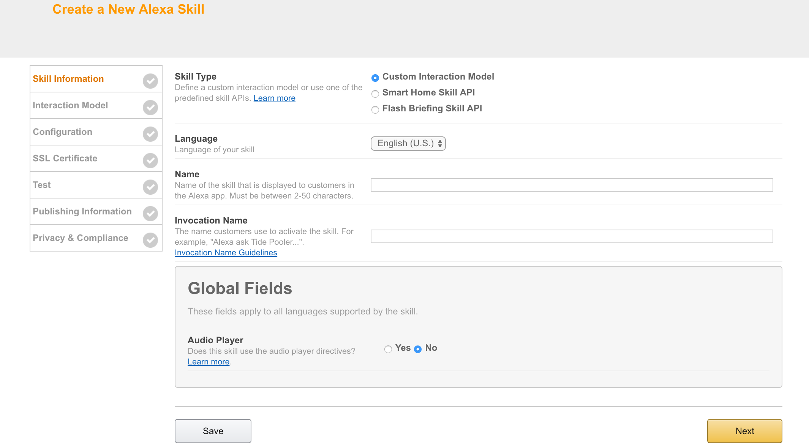
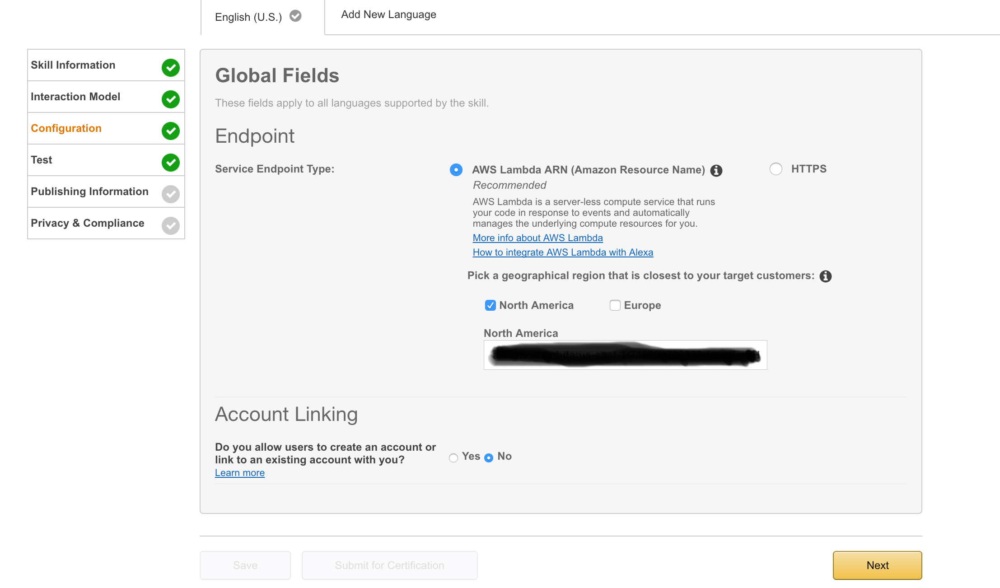
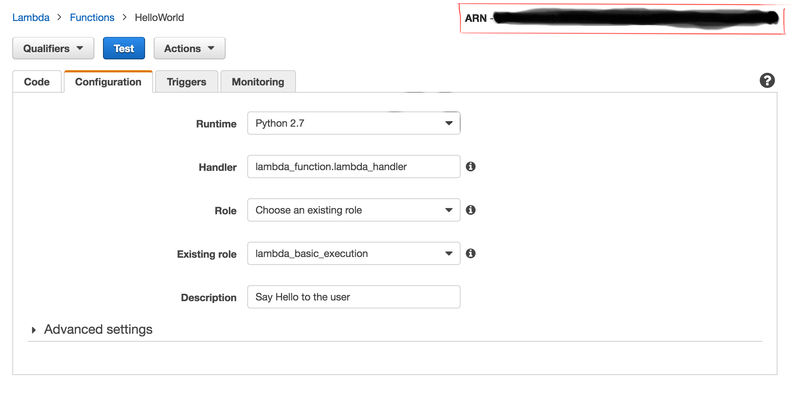
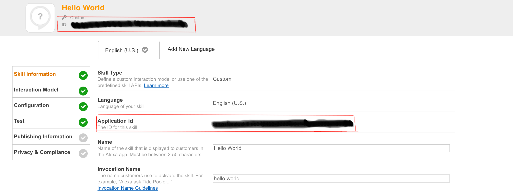

<fs x-large>Creating the Skill with Alexa Skills Kit</fs>

-----------------------------------------------------------------------------------------------------------------------------

**Author:** Tristan Brodeur 

**Email:** brodeurtristan@gmail.com

**Date:** Last modified on 12/29/16 

**Keywords:** Alexa, Amazon Skills Kit</fs>

-----------------------------------------------------------------------------------------------------------------------------

<fs large>**Creating your Amazon Developer Account**</fs>

-Start by signing up for a developer portal account.

-Click on Sign in or Create Free Account in the top-right corner of
the [Amazon Developer page](https://developer.amazon.com/). First, you’ll see the default Amazon
login. Use it to either create a brand new account or use your existing
Amazon account (the same one you used when signing up for AWS,
for example) to sign in.

-If you haven’t used the developer portal before, you’ll be asked
to enter some information about your company and to accept the
application distribution agreement. This information is shared between
any apps you might create for the Amazon Marketplace using this
account.

-Finally, in the last step, the sign-up flow asks you about payments.
Currently, Alexa Skills cannot be sold or purchased, so if you only
plan to develop Alexa Skills, choose No for both questions to skip
any monetization-related setup steps. If you decide to monetize your
applications later, you can always return to the setup when it becomes
relevant.

-Click on Save and Continue.

-Now, you’re signed up and ready to add your first skill.

-----------------------------------------------------------------------------------------------------------------------------

<fs large>**Adding your skill**</fs>

-Once signed in to the Developer Console, navigate to the Alexa
Skills Kit page: first, click on Apps & Services on the top menu, and
then in the sub menu, select Alexa.

-On this page, you’ll see the following options:



-Select Alexa Skills Kit by clicking on its Get Started button.

-In the screen that shows up, you’ll find all the Alexa Skills you’ve built.If this is your first time creating a skill, the list will be empty. Click on Add New Skill to begin defining your first one.

-First, on the Skill Information tab, enter some basic information to
identify your new skill.



  * Skill Type: Choose “Custom Interaction Model” since you will create a custom skill where you define the interaction model. You can learn more about the different types of Alexa skills [here](https://developer.amazon.com/public/solutions/alexa/alexa-skills-kit/docs/understanding-the-different-types-of-skills).
  * Name: A descriptive name for the Skill. Once you publish your skill, this is the name your potential users will see.
  * Invocation Name:The name that the users will use when they want to tell Alexa to execute this skill, for example, “Alexa, open Hello World.” Notice that it doesn’t have to be the same as the skill’s name. When deciding on the invocation name, test your ideas with an Echo device to make sure the name you pick is easy for Alexa to recognize. This way you can be sure that your users will be able to activate your skill without any extra trouble.

-Once the information is in place, click Next. Notice that you can always come back to edit this information later if there are mistakes. After saving the step, you’ll also find the Skill’s Application ID by coming back to this step (so you can use it in your code to verify the requests).

-----------------------------------------------------------------------------------------------------------------------------

<fs large>**Configuring the Intent Schema**</fs>

-In the Alexa architecture, Intents can be thought of as distinct functions that a Skill can perform. The Alexa platform uses an “Intent Schema”, expressed in JSON, to communicate which function the code for a Custom Skill should execute to fulfill a given request. Intents can also take arguments which are known here as Slots.

//-For our "Hello World" example, we’ll want to be able to ask Alexa to say "Hello World" to the user when requested.For this, we'll use an intent titled "Hello".//

-Alexa has a few standard Intents that Custom Skills should implement:

  * AMAZON.HelpIntent: provide the user with some help text
  * AMAZON.StopIntent: let the user stop an operation
  * AMAZON.CancelIntent: let the user cancel an operation

- An Intent Schema defines the set of Intents used by the skill, intent parameters, known as Slots, and Utterances, phrases that the user will say to execute one of the intents defined in the Intent Schema.

//-For the "Hello World" example, our intent schema will look like this://

```json
{
  "intents": [
    {
    "intent": "Hello"
    },
    {
      "intent": "AMAZON.HelpIntent"
    },
    {
      "intent": "AMAZON.StopIntent"
    },
    {
      "intent": "AMAZON.CancelIntent"
    }
 ]
}
```

-----------------------------------------------------------------------------------------------------------------------------

<fs large>**Configuring Sample Utterances**</fs>

-“Sample Utterances” are where we define the phrases that Alexa needs to hear in order to invoke each of our Custom Skill’s Intents. This is done using a simple text list of the format:

```json
<Intent Name>""<Phrase>
```

-Where “” can optionally contain references to Slots (arguments). 

//-If you are following the "Hello World" tutorial, we’ll use the following set of Sample Utterances here://

```json
Hello say hello
Hello speak hello
Hello hello
```

-Note also that we don’t need to provide sample utterances for the stop, cancel, and help intents. Alexa understands appropriate phrases to invoke each of these out of the box.

-Once the interaction model is complete, click next and continue on to the configuration tab to link your skill with your function.

-----------------------------------------------------------------------------------------------------------------------------

<fs large>**Linking with the Lambda Function**</fs>




-If you are running your code with AWS Lambda, choose AWS Lambda ARN, else choose HTTPS.

//-If you are following the "Hello World" tutorial, we will be using AWS Lambda.//

-Depending on the region you are in, choose either North America or Europe and insert your Amazon Resource Code (ARN) listed in the top right corner of your lambda function in your AWS console.




-Also make sure to change the application id in your lambda function that handles the event to the id code listed under your skill name:



-Click "Next"

-----------------------------------------------------------------------------------------------------------------------------

<fs large>**Testing**</fs>

***Video Demonstration***

<a href="https://www.youtube.com/watch?v=K0gyfY5D9dM"></a>

----


The Custom Skill can be tested using the Service Simulator within the Amazon Developer portal and without the need to use an Echo hardware device. We can type in sample sentences that the user might speak, view the JSON message that is sent to the Lambda function and its response JSON as well as listen to how the response would sound when played back on an Echo.

Here we can see that Alexa determined that this request related to the “Hello” intent (because we used a phrase from our sample utterances that are associated with that intent).

The Lambda function read “Hello” as the intent and called the say_hello Python function that we wrote.

If an Echo device is associated with our Amazon developer account, we can go ahead and directly test this with that device. If not, we can hear what the response would sound like simply by pressing the “Listen” button in the Service Simulator.

-----------------------------------------------------------------------------------------------------------------------------

<fs large>**Next Steps**</fs>

-If you are following the "Hello World" tutorial, you are now finished.

-Using this base knowledge, go on to create custom skills such as a [stock price skill](https://github.com/twbot/AmazonAlexaStockPrice).


